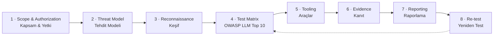

# LLM & Agent Red-Team Playbook

<p align="center">
  <b>A practical, standards-mapped playbook for red-teaming LLM applications and AI agents.</b><br>
  <b>LLM uygulamaları ve yapay zeka ajanları için pratik, standartlara bağlı bir red-team oyun kitabı.</b><br>
  Scope &amp; authorization → threat model → recon → OWASP LLM Top 10 test matrix → tooling → evidence → reporting → re-test.
</p>

<p align="center">
  <a href="LICENSE"></a>
  
  
  
  
  
  
</p>

---

> ### ⚠️ Authorized testing only — Yalnızca yetkili test
>
> **EN —** Everything in this playbook is for **assessing systems you own or are explicitly, contractually authorized in writing to test.** Prompt injection, data-exfiltration probes, jailbreaks, and resource-exhaustion tests against a third party without a signed authorization are likely illegal in most jurisdictions and can breach a provider's terms of service. Get the paper first. This repository ships **methodology, checklists, and a report template — not exploits.**
>
> **TR —** Bu oyun kitabındaki her şey, **sahibi olduğunuz ya da yazılı ve sözleşmeye dayalı olarak test etme yetkiniz bulunan sistemleri değerlendirmek** içindir. Yetki belgesi olmadan üçüncü bir tarafa karşı prompt injection, veri sızdırma denemeleri, jailbreak veya kaynak tüketimi testleri çoğu hukuk düzeninde suç oluşturabilir ve sağlayıcının kullanım şartlarını ihlal edebilir. **Önce imzalı yetkiyi alın.** Bu depo **istismar kodu değil; yöntem, kontrol listeleri ve rapor şablonu** sunar.

---

## Contents · İçindekiler

- [What this is](#what-this-is--bu-nedir)
- [The workflow](#the-workflow--iş-akışı)
- [Phase 1 — Scope &amp; Authorization / Kapsam ve Yetki](#phase-1--scope--authorization--kapsam-ve-yetki)
- [Phase 2 — Threat Model / Tehdit Modeli](#phase-2--threat-model--tehdit-modeli)
- [Phase 3 — Reconnaissance / Keşif](#phase-3--reconnaissance--keşif)
- [Phase 4 — Test Matrix across OWASP LLM Top 10 (2025)](#phase-4--test-matrix-across-owasp-llm-top-10-2025--owasp-llm-top-10-boyunca-test-matrisi)
- [Phase 5 — Tools / Araçlar](#phase-5--tools--araçlar)
- [Phase 6 — Evidence Collection / Kanıt Toplama](#phase-6--evidence-collection--kanıt-toplama)
- [Phase 7 — Reporting / Raporlama](#phase-7--reporting--raporlama)
- [Phase 8 — Re-test / Yeniden Test](#phase-8--re-test--yeniden-test)
- [Report template · Rapor şablonu](#report-template--rapor-şablonu)
- [Related open work (ecosystem)](#related-open-work--i̇lgili-açık-çalışmalar)
- [Contributing · References · License](#contributing--katkı)

---

## What this is · Bu nedir

**EN —** A repeatable, evidence-first methodology for testing the security of LLM-backed products and agentic systems: chat assistants, RAG apps, tool-using agents, MCP servers, and the extensions (Skills / rules files) they load. Every test class is mapped to the **[OWASP Top 10 for LLM Applications 2025](https://genai.owasp.org/llm-top-10/)** and to **[MITRE ATLAS](https://atlas.mitre.org/)** so findings speak a shared, defensible vocabulary. It is a **living document** and a seed version — contributions and corrections are welcome.

**TR —** LLM tabanlı ürünlerin ve ajan sistemlerinin güvenliğini test etmek için tekrarlanabilir, kanıt-öncelikli bir yöntem: sohbet asistanları, RAG uygulamaları, araç kullanan ajanlar, MCP sunucuları ve bunların yüklediği eklentiler (Skill'ler / kural dosyaları). Her test sınıfı **OWASP LLM Top 10 (2025)** ve **MITRE ATLAS**'a eşlenir; böylece bulgular ortak ve savunulabilir bir dille konuşur. Bu bir **yaşayan belgedir** ve tohum sürümdür; katkılar ve düzeltmeler memnuniyetle karşılanır.

**Why standards-mapped matters.** A red-team report that says "the bot did something weird" is unactionable. A report that says *"LLM01:2025 Prompt Injection via indirect content (MITRE ATLAS AML.T0051.001), reproduced with the payload below, exfiltrated the system prompt"* is triage-ready. This playbook is built to produce the second kind.

**Honest scope.** This is methodology, not a magic scanner. LLM behavior is probabilistic — a probe that fails ten times can succeed on the eleventh, and a fix can regress. Treat every result as a data point with a reproduction rate, not a boolean, and always re-test. Many LLM-application weaknesses are design/configuration flaws that have **no CVE**; the canonical CVE this playbook does lean on is **[CVE-2021-42574](https://nvd.nist.gov/vuln/detail/CVE-2021-42574)** (bidirectional-override "Trojan Source" text) for the hidden-text class.

---

## The workflow · İş akışı



Phases 4–6 iterate: as recon reveals surfaces you refine the matrix, run tools, and capture evidence in a loop until coverage is complete.

---

## Phase 1 — Scope &amp; Authorization / Kapsam ve Yetki

**EN — Goal:** establish, in writing, *what* you may test, *how hard*, *when*, and *who to call*. No probe fires before this is signed.
**TR — Amaç:** *neyi*, *ne kadar zorlayarak*, *ne zaman* test edebileceğinizi ve *kimi arayacağınızı* yazılı olarak belirlemek. İmza olmadan hiçbir deneme başlamaz.

### Authorization checklist · Yetki kontrol listesi

- [ ] **Signed authorization / Rules of Engagement (RoE)** in place, naming the legal entity that owns the target. *İmzalı yetki / Angajman Kuralları, hedefi sahiplenen tüzel kişiyi adıyla belirtir.*
- [ ] **In-scope assets** listed exactly — endpoints, model/agent names, versions, MCP servers, extensions, tenant/environment (prefer **staging**). *Kapsamdaki varlıklar tam olarak listelenir.*
- [ ] **Out-of-scope** explicitly stated — third-party model providers, shared infra, other tenants, real PII. *Kapsam dışı açıkça yazılır — üçüncü taraf model sağlayıcıları, paylaşımlı altyapı, diğer kiracılar, gerçek kişisel veri.*
- [ ] **Provider Terms of Service** checked — many prohibit adversarial testing of the *hosted model*; you may test *your application*, not their model weights. *Sağlayıcı kullanım şartları kontrol edildi.*
- [ ] **Data handling** agreed — synthetic data only; if real data is unavoidable, define KVKK/GDPR-compliant handling, retention, and destruction. *Veri işleme mutabık — mümkünse yalnızca sentetik veri.*
- [ ] **Time window, rate limits, and cost ceiling** agreed (LLM tests burn tokens — set a budget so testing isn't its own denial-of-wallet). *Zaman penceresi, hız sınırı ve maliyet tavanı belirlendi.*
- [ ] **Emergency contact + kill-switch/rollback** path defined for agents with real side effects (email, payments, tickets, code execution). *Acil durum kişisi ve durdurma/geri-alma yolu tanımlandı.*
- [ ] **Evidence-handling &amp; disclosure** terms agreed (where transcripts live, who sees them, coordinated-disclosure timeline). *Kanıt saklama ve açıklama şartları mutabık.*

> **Rule of thumb:** if an agent can *act* (send, buy, delete, deploy), assume every test can have a real-world effect and require an explicit "may we exercise side-effecting tools?" line in the RoE.

---

## Phase 2 — Threat Model / Tehdit Modeli

**EN — Goal:** decide what you're actually defending and against whom, so testing targets real risk instead of noise.
**TR — Amaç:** gerçekte neyi ve kime karşı savunduğunuza karar vermek; böylece test, gürültü yerine gerçek riski hedefler.

**Questions to answer · Yanıtlanacak sorular**

1. **Assets / Varlıklar** — system prompt, user PII, RAG corpus, API keys and secrets reachable by tools, downstream systems the agent can reach.
2. **Trust boundaries / Güven sınırları** — where does *untrusted content* enter the context window? (user input, retrieved documents, web pages, tool outputs, emails, uploaded files, extension/skill text).
3. **Agency / Yetki** — what tools can the model call, with what privileges, and can a tool's *output* re-enter the prompt (indirect injection loop)?
4. **The lethal trifecta** *(Simon Willison)* — does the system combine **(a) access to private data + (b) exposure to untrusted content + (c) an outbound channel**? All three together turn one injection into data theft. Map whether any single path holds all three legs.
5. **Adversary / Rakip** — external user, malicious document author, poisoned extension/skill publisher, compromised MCP server, insider.

Produce a one-page data-flow diagram marking every trust boundary crossing; those crossings become your Phase-4 test targets. For the extension/supply-chain boundary specifically, see **[awesome-agent-supply-chain-security](https://github.com/fevziegeyurtsevenler/awesome-agent-supply-chain-security)** for a curated threat catalog.

---

## Phase 3 — Reconnaissance / Keşif

**EN — Goal:** map the real attack surface before firing structured tests.
**TR — Amaç:** yapılandırılmış testlerden önce gerçek saldırı yüzeyini haritalamak.

**Enumerate · Sayım**

- **Model &amp; params** — provider/model/version, temperature, context window, whether streaming, and any moderation layer in front.
- **Inputs** — every field that reaches the prompt: chat box, file upload, URL fetch, RAG sources, tool results, system/user/developer message split.
- **Tools &amp; agency** — the tool/function list, their parameter schemas, and which are side-effecting. For **MCP servers** and **agent Skills / rules files** (`CLAUDE.md`, `AGENTS.md`, `.cursorrules`), remember the *description* text is read **by the model**.
- **Guardrails** — input/output filters, allow/deny lists, rate limits, egress controls, output-encoding on the downstream sink.
- **Supply chain** — third-party skills, MCP servers, plugins, and prompt templates the app loads. **Statically scan these before dynamic testing** with **[`uncloak`](https://github.com/fevziegeyurtsevenler/uncloak)** to surface hidden-Unicode instructions, tool-description poisoning, and lethal-trifecta posture:
  ```bash
  uncloak scan ./target-agent-repo --format sarif -o recon.sarif
  ```
  For grounding on what real-world extensions look like, the **[skills-in-the-wild](https://github.com/fevziegeyurtsevenler/skills-in-the-wild)** open audit ran `uncloak` across **3,168 real public agent extensions** — a useful baseline for "is this finding normal or notable?" (Independently, Snyk reported in 2026 that of 3,984 agent skills analyzed, a large share were problematic — a third-party figure, cited as reported, not verified here.)

**Passive first.** Fingerprint behavior with benign prompts (does it echo its system prompt structure? does it reveal tool names in errors?) before anything adversarial.

---

## Phase 4 — Test Matrix across OWASP LLM Top 10 (2025) · OWASP LLM Top 10 boyunca test matrisi

**EN —** The core of the engagement. Work every row; record for each probe: payload, model+params, timestamp, verdict, and **reproduction rate over N attempts**. Payloads for injection/extraction rows can be drawn from **[prompt-injection-corpus](https://github.com/fevziegeyurtsevenler/prompt-injection-corpus)** (EN/TR) — and test **non-English payloads deliberately**, since many guardrails are English-tuned and Turkish/other-language instruction smuggling walks straight through.
**TR —** Angajmanın çekirdeği. Her satırı işleyin; her deneme için kaydedin: yük, model+parametreler, zaman damgası, karar ve **N denemede yeniden üretim oranı**. İngilizce olmayan yükleri bilinçli test edin — birçok koruma İngilizceye ayarlıdır.

> **ATLAS ID note:** ATLAS technique IDs evolve as the matrix is updated. IDs below reflect the current mapping used across this ecosystem; **confirm the live ID at [atlas.mitre.org](https://atlas.mitre.org/) before quoting one in a client deliverable.**

| OWASP LLM (2025) | MITRE ATLAS | What to test · Ne test edilir | Signals a finding · Bulgu işareti |
|---|---|---|---|
| **LLM01 Prompt Injection** | `AML.T0051` (`.000` Direct, `.001` Indirect), `AML.T0054` Jailbreak | Direct overrides ("ignore previous…"), **indirect** injection via RAG docs / web / tool output / file uploads, persona jailbreaks, hidden-Unicode smuggling (`CVE-2021-42574` bidi, Tags-block, zero-width). | Model follows attacker instruction over system policy; acts on hidden text. |
| **LLM02 Sensitive Information Disclosure** | `AML.T0057` LLM Data Leakage | Extraction of PII, secrets, training/RAG data, other users' data (cross-tenant), verbatim confidential context. | Model returns data the user isn't entitled to. |
| **LLM03 Supply Chain** | `AML.T0010` ML Supply Chain Compromise, `AML.T0011` User Execution, `AML.T0053` LLM Plugin Compromise | Malicious/poisoned skills, MCP servers, plugins, model artifacts, prompt templates; rug-pull update channels. **Scan with `uncloak` (Phase 3).** | Loaded extension carries hidden instructions / unsafe code / trigger-conditioned behavior. |
| **LLM04 Data &amp; Model Poisoning** | ATLAS: Poison Training Data / Backdoor ML Model *(confirm ID)* | Poisoned fine-tune/embedding data, backdoor triggers, RAG-corpus poisoning that biases or backdoors outputs. | A crafted trigger reliably flips behavior. |
| **LLM05 Improper Output Handling** | `AML.T0011` User Execution (downstream) | LLM output flowing unsanitized into a sink: **XSS, SSRF, SQLi, path traversal, command injection, RCE** via rendered/eval'd model output. | Model output becomes code/markup in a downstream system. |
| **LLM06 Excessive Agency** | `AML.T0053` LLM Plugin Compromise, `AML.T0051.001` Indirect | Over-permissioned tools, missing human-in-the-loop on side-effecting actions, confused-deputy via injected tool calls, unscoped autonomy. | Injection causes the agent to *act* (send/buy/delete/deploy). |
| **LLM07 System Prompt Leakage** | ATLAS: LLM Meta Prompt Extraction *(confirm ID)* | Coax the system/developer prompt, embedded secrets or business rules, tool schemas, guardrail wording. | System prompt or its embedded secrets recovered. |
| **LLM08 Vector &amp; Embedding Weaknesses** | `AML.T0051.001` Indirect, `AML.T0057` Leakage | RAG poisoning, embedding-space collisions, cross-tenant retrieval leakage, retrieval of documents the user shouldn't see, embedding inversion. | Retrieval returns/executes attacker-planted or unauthorized content. |
| **LLM09 Misinformation** | *(no single ATLAS technique; integrity impact)* | Hallucinated facts/citations/APIs, unsafe over-reliance, insecure package/code suggestions, authoritative-sounding wrong answers in high-stakes flows. | Confident, wrong, and acted upon without verification. |
| **LLM10 Unbounded Consumption** | ATLAS: Cost Harvesting *(confirm ID)*, `AML.T0024` Exfiltration via ML Inference API | Resource exhaustion, **denial-of-wallet**, unbounded loops/recursion in agents, model extraction/replication via high-volume querying. | Uncapped spend/compute, or the model is siphoned by query. |

**Method per cell · Hücre başına yöntem:** (1) baseline benign behavior → (2) single crafted probe → (3) if it lands, minimize to the smallest reliable payload → (4) measure reproduction rate over N≥10 → (5) capture evidence (Phase 6) → (6) chain it (does LLM01 → LLM06 → LLM02 form a real exfil path? that's your headline finding, often the lethal trifecta).

---

## Phase 5 — Tools / Araçlar

**EN —** Use tools to scale coverage, but **read every payload before you fire it** and keep everything inside authorized scope. Listing here is not endorsement.
**TR —** Kapsamı genişletmek için araç kullanın, ama **her yükü ateşlemeden önce okuyun** ve her şeyi yetkili kapsam içinde tutun. Buradaki liste onay anlamına gelmez.

| Tool | Use for | Notes |
|---|---|---|
| **[`uncloak`](https://github.com/fevziegeyurtsevenler/uncloak)** | Static scan of skills / MCP configs / rules files (LLM03) — hidden Unicode, tool-poisoning, lethal-trifecta posture | Zero-dependency, SARIF output, EN+TR patterns; run in recon and CI |
| **[prompt-injection-corpus](https://github.com/fevziegeyurtsevenler/prompt-injection-corpus)** | Ready payloads for LLM01/07/08, incl. **Turkish** and multilingual | Source your matrix probes here |
| **[llm-security-skills](https://github.com/fevziegeyurtsevenler/llm-security-skills)** | Agent Skills that operationalize parts of this playbook inside an assistant | Skills-first automation of checks |
| **[garak](https://github.com/NVIDIA/garak)** | Automated LLM vulnerability scanning (many probe families) | Good for broad first-pass coverage |
| **[PyRIT](https://github.com/Azure/PyRIT)** | Orchestrated, scriptable red-team automation (Microsoft) | Multi-turn attack automation |
| **[promptfoo](https://github.com/promptfoo/promptfoo)** | Red-team + eval harness, CI-friendly, regression tracking | Ideal for re-test (Phase 8) |
| **[Giskard](https://github.com/Giskard-AI/giskard)** | LLM/ML testing &amp; scanning | Complements manual probing |
| **Burp Suite / OWASP ZAP** | The web/API layer around the model (auth, IDOR, SSRF from LLM05) | The app is still a web app |

> Automated scanners raise coverage and false positives in equal measure. Every automated hit is a **lead**, not a finding, until you reproduce it by hand and score its reproduction rate.

---

## Phase 6 — Evidence Collection / Kanıt Toplama

**EN — Goal:** make every finding independently reproducible by someone who wasn't in the room.
**TR — Amaç:** her bulguyu, odada olmayan birinin bağımsız olarak yeniden üretebilmesini sağlamak.

**Capture for every finding · Her bulgu için toplayın**

- [ ] **Exact payload** (raw bytes — hex-dump hidden-Unicode payloads so they survive copy-paste). *Tam yük (gizli Unicode için hex döküm).*
- [ ] **Full transcript** — system/developer/user/tool messages, not just the punchline. *Tam konuşma dökümü.*
- [ ] **Model + parameters + timestamp** (model, version, temperature, top-p, seed if available). *Model + parametreler + zaman damgası.*
- [ ] **Reproduction rate** — "8/10 attempts" beats "it worked once." *Yeniden üretim oranı.*
- [ ] **Screenshots / screen recording** for UI-visible effects. *Ekran görüntüsü / kayıt.*
- [ ] **Integrity** — hash artifacts (`sha256`), keep an append-only test log, sync clocks. *Bütünlük — artefakt hash'i, salt-ekleme test günlüğü.*
- [ ] **Chain-of-impact** — the sequence of probes that turned a behavior into business impact. *Etki zinciri.*

**Handle data responsibly:** redact real PII before it leaves the test environment; store transcripts per the RoE; never paste client secrets into third-party tools.

---

## Phase 7 — Reporting / Raporlama

**EN — Goal:** a report an engineer can fix from and a manager can prioritize with.
**TR — Amaç:** bir mühendisin düzeltebileceği, bir yöneticinin önceliklendirebileceği bir rapor.

**Each finding carries · Her bulgu şunları taşır:** stable ID · OWASP LLM + ATLAS mapping · severity · affected surface · preconditions · reproduction steps · evidence · impact · remediation · references · re-test status.

**Severity · Önem derecesi.** There is **no universally accepted severity standard for LLM-app findings** yet — be explicit about your scheme. A workable default: score with **CVSS 4.0** for the technical vector, then adjust qualitatively for LLM-specific factors — **reachability** (can an external user trigger it?), **agency** (does it cause action or just talk?), **data sensitivity**, and **reproduction rate**. State the final rating *and* the reasoning; don't hide judgment behind a number. Cross-reference the OWASP Risk Rating methodology if the client expects it.

**Reporting checklist · Rapor kontrol listesi**

- [ ] Executive summary in plain language + a risk heat-map. *Sade dilde yönetici özeti + risk ısı haritası.*
- [ ] Methodology names OWASP LLM Top 10 (2025) + MITRE ATLAS + this playbook version. *Yöntem, standartları ve sürümü belirtir.*
- [ ] Every finding is reproducible from the report alone. *Her bulgu yalnız rapordan yeniden üretilebilir.*
- [ ] Remediation is specific and defense-in-depth (not "add a filter"). *Giderme, spesifik ve katmanlı savunma.*
- [ ] Coverage matrix: which OWORP rows were tested, which were out of scope and why. *Kapsam matrisi: hangi satırlar test edildi/dışında.*
- [ ] Positive assurances too — what you tried that **didn't** work is signal. *Olumlu güvenceler — işe yaramayanlar da bilgidir.*

---

## Phase 8 — Re-test / Yeniden Test

**EN — Goal:** verify fixes actually close the finding — and didn't just move it.
**TR — Amaç:** düzeltmelerin bulguyu gerçekten kapattığını — ve yalnızca yerini değiştirmediğini — doğrulamak.

- [ ] Re-run the **exact original payload**; confirm it now fails. *Orijinal yükü aynen tekrar çalıştırın.*
- [ ] Re-run **variants** — LLM fixes often patch the string, not the behavior (try paraphrase, another language, encoding, indirect delivery). *Varyantları çalıştırın — özellikle başka dil/kodlama/dolaylı teslim.*
- [ ] Check the fix didn't **over-block** legitimate use (guardrails that break the product are their own finding). *Aşırı engelleme kontrolü.*
- [ ] Regression-test the whole matrix — a filter added for LLM01 can open LLM09/over-refusal. *Tüm matriste regresyon testi.*
- [ ] Automate the re-test (e.g. promptfoo) so it runs in CI forever. *Yeniden testi CI'da kalıcı otomatikleştirin.*
- [ ] Update finding status: **Open / Fixed / Risk-accepted / Won't-fix**, with date + re-tester. *Bulgu durumunu güncelleyin.*

---

## Report template · Rapor şablonu

Copy into `templates/report.md`. Fields are bilingual; delete the language you don't need.

```markdown
# LLM Red-Team Report — <Target> / <Hedef>
Engagement / Angajman: <id>   Dates / Tarihler: <start–end>
Tester(s) / Test eden(ler): <name>   Authorization ref / Yetki ref: <doc-id>
Playbook version / Oyun kitabı sürümü: llm-red-team-playbook <vX.Y>

## 1. Executive summary / Yönetici özeti
<plain-language risk picture — 1 paragraph + heat-map>

## 2. Scope & RoE / Kapsam ve Angajman Kuralları
In-scope / Kapsam içi: <...>   Out-of-scope / Kapsam dışı: <...>
Environment / Ortam: <staging|prod>   Constraints / Kısıtlar: <rate, budget, window>

## 3. Methodology / Yöntem
Standards / Standartlar: OWASP LLM Top 10 (2025) · MITRE ATLAS
Coverage matrix / Kapsam matrisi: <LLM01..LLM10: tested / n-a + why>
Tools / Araçlar: <uncloak, corpus, garak, ...>

## 4. Findings / Bulgular
| ID | Title / Başlık | OWASP | ATLAS | Severity | Status |
|----|----------------|-------|-------|----------|--------|
| RT-001 | ... | LLM01 | AML.T0051.001 | High | Open |

### RT-001 — <title / başlık>
- OWASP / ATLAS: LLM01:2025 · AML.T0051.001
- Severity / Önem: <rating> — CVSS 4.0 <vector> + rationale / gerekçe
- Affected surface / Etkilenen yüzey: <endpoint | tool | skill | RAG source>
- Preconditions / Ön koşullar: <auth level, entry point>
- Reproduction / Yeniden üretim:
  1. Model + params + timestamp: <...>
  2. Payload (raw / hex if hidden): <...>
  3. Observed / Gözlemlenen: <...>
  4. Reproduction rate / Oran: <8/10>
- Evidence / Kanıt: <transcript ref, sha256, screenshot>
- Impact / Etki: <business impact + chain>
- Remediation / Giderme: <specific, defense-in-depth>
- Re-test / Yeniden test: <date · Open/Fixed/Risk-accepted>

## 5. Positive assurances / Olumlu güvenceler
<attack classes attempted that did not succeed>

## 6. Appendix / Ek
<full payloads, tool configs, raw logs>
```

---

## Repository layout · Depo düzeni

```
llm-red-team-playbook/
├─ README.md                     ← this playbook (EN + TR)
├─ playbook/                     ← one file per phase, expanded
│  ├─ 1-scope-authorization.md
│  ├─ 2-threat-model.md
│  ├─ 3-recon.md
│  ├─ 4-owasp-llm-matrix.md
│  ├─ 5-tools.md
│  ├─ 6-evidence.md
│  ├─ 7-reporting.md
│  └─ 8-retest.md
├─ checklists/                   ← copy-paste checklists (authorization, per-phase, evidence)
├─ matrix/owasp-llm-2025.md      ← the full OWASP × ATLAS × probe matrix
└─ templates/report.md           ← the bilingual report template above
```

---

## Related open work · İlgili açık çalışmalar

Part of an open, Turkish- and multilingual-first line of LLM/agent security research:

- **[uncloak](https://github.com/fevziegeyurtsevenler/uncloak)** — zero-dependency scanner for hidden prompt injection &amp; supply-chain risk in Skills / MCP / rules files (used in Phases 3 &amp; 5).
- **[skills-in-the-wild](https://github.com/fevziegeyurtsevenler/skills-in-the-wild)** — open audit of **3,168 real public agent extensions**; a baseline for judging supply-chain findings.
- **[awesome-agent-supply-chain-security](https://github.com/fevziegeyurtsevenler/awesome-agent-supply-chain-security)** — curated resources on agent/LLM supply-chain security (threat catalog for Phase 2).
- **[llm-security-skills](https://github.com/fevziegeyurtsevenler/llm-security-skills)** — agent Skills that operationalize parts of this playbook inside an assistant.
- **[prompt-injection-corpus](https://github.com/fevziegeyurtsevenler/prompt-injection-corpus)** — open EN/TR corpus of prompt-injection payloads (source for the Phase-4 matrix).

---

## Contributing · Katkı

New probes, ATLAS-mapping corrections, non-English payloads, and template improvements are the most valuable contributions. Open an issue or PR. **Do not** submit findings, transcripts, or exploits against real third-party systems you weren't authorized to test.

Katkı olarak en değerlisi: yeni denemeler, ATLAS eşleme düzeltmeleri, İngilizce olmayan yükler ve şablon iyileştirmeleri. Yetkiniz olmayan gerçek sistemlere ait bulgu/istismar göndermeyin.

## References · Kaynaklar

- [OWASP Top 10 for LLM Applications 2025](https://genai.owasp.org/llm-top-10/)
- [MITRE ATLAS](https://atlas.mitre.org/)
- [CVE-2021-42574 — Trojan Source (bidirectional overrides)](https://nvd.nist.gov/vuln/detail/CVE-2021-42574)
- Simon Willison — *The lethal trifecta for AI agents*
- [OWASP Risk Rating Methodology](https://owasp.org/www-community/OWASP_Risk_Rating_Methodology)

## License · Lisans

[Apache-2.0](LICENSE) © Fevzi Ege Yurtsevenler

<sub>A living, community-maintained playbook for authorized LLM/agent red-teaming. Not affiliated with OWASP or MITRE; it maps to their public frameworks. If it made your next assessment sharper, a ⭐ helps others find it. · Yetkili LLM/ajan red-team testleri için yaşayan bir oyun kitabı.</sub>
